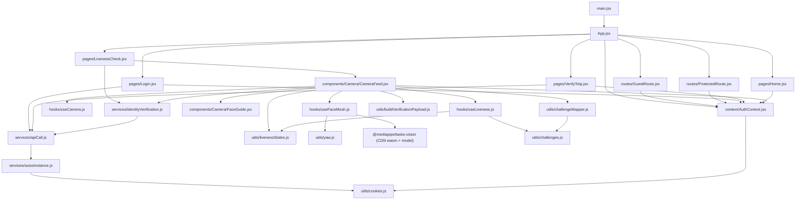

# Kormic Liveness Frontend — Architecture & File Guide

> ⚠️ **Living document — not a permanent spec.** This project is actively in development. The
> routing, auth flow, and file layout described below are a snapshot as of **2026-07-14** and
> will keep changing as features land. If something here disagrees with the code, trust the code
> and update this file rather than assuming the doc is right.

**Scope:** `src/` of the React liveness frontend (Vite + React 19). Documents every file that
exists today, how they import/call each other, the end-to-end runtime flow, and which files are
wired in vs. unused scaffolding.

---

## 1. Folder Structure (annotated)

```text
src/
├── main.jsx                      # Entry point — mounts <App/>
├── App.jsx                       # Root component — sets up BrowserRouter + AuthProvider + Routes
├── index.css                     # Global reset + page background
│
├── context/
│   └── AuthContext.jsx           # isAuthenticated / isLivenessVerified state, login/logout/completeLiveness, cookie-backed
│
├── routes/
│   ├── ProtectedRoute.jsx        # Redirects to /login if not authenticated; can also require liveness
│   └── GuestRoute.jsx            # Redirects authenticated users away from /login
│
├── pages/
│   ├── Login.jsx / Login.css     # Email + password form, calls /auth/login/
│   ├── VerifyTotp.jsx / VerifyTotp.css  # 6-digit TOTP form, calls /auth/verify-totp/
│   ├── LivenessCheck.jsx         # Screen: Start/Stop verification, owns session state (was "Home.jsx")
│   └── Home.jsx                  # Post-verification landing screen ("Welcome to Korgut"), has Logout
│
├── components/
│   ├── Camera/
│   │   ├── CameraFeed.jsx        # Orchestrator: wires camera + face mesh + liveness together, submits to backend
│   │   ├── FaceGuide.jsx         # Static oval overlay (pure UI, no logic)
│   │   └── CameraCanvas.jsx      # ⚠ EMPTY — not implemented, not imported anywhere
│   └── UI/
│       ├── Button.jsx            # ⚠ EMPTY — not implemented
│       ├── ProgressBar.jsx       # ⚠ EMPTY — not implemented
│       ├── PromptCard.jsx        # ⚠ EMPTY — not implemented
│       └── StatusIndicator.jsx   # ⚠ EMPTY — not implemented
│
├── hooks/
│   ├── useCamera.js               # Webcam lifecycle, frame buffer, best-frame capture
│   ├── useFaceMesh.js             # MediaPipe FaceLandmarker loop, face metrics, yaw
│   └── useLiveness.js             # Challenge/liveness state machine (reducer)
│
├── services/
│   ├── axiosInstance.js           # Configured axios client (baseURL, withCredentials, Bearer token interceptor)
│   ├── apiCall.js                 # Thin get/post/put/delete wrappers around axiosInstance
│   ├── identityVerification.js    # Backend API calls (create/complete/get session), built on apiCall.js
│   └── mediapipe.js               # ⚠ EMPTY — not implemented (MediaPipe logic currently lives inline in useFaceMesh.js)
│
├── config/
│   └── api.js                     # ⚠ ORPHANED — exports API_BASE_URL but nothing imports it anymore;
│                                   #   axiosInstance.js now hardcodes its own BASE_URL instead
│
└── utils/
    ├── cookies.js                  # setCookie/getCookie/removeCookie — backs AuthContext's session persistence
    ├── yaw.js                      # Pure function: landmarks → yaw angle in degrees
    ├── challenges.js               # ChallengeType enum + DEFAULT_CHALLENGES fallback sequence
    ├── challengeMapper.js          # Backend challenge strings → internal ChallengeType objects
    ├── buildVerificationPayload.js # Assembles the payload POSTed to .../complete/
    ├── livenessStates.js           # LIVENESS_STATES enum, FAILURE_REASONS, failure message copy
    ├── quality.js                  # ⚠ EMPTY — not implemented
    └── randomPrompt.js             # Defines generateRandomPromptSequence — not imported anywhere yet
```

`⚠ EMPTY` files exist on disk but currently have zero content and nothing in `src/` imports them.
`⚠ ORPHANED` means the file has real content but is no longer wired into the app. Treat both as
reserved slots / stale leftovers, not as dead code to clean up blindly — verify with whoever added
them before deleting.

---

## 2. Module Dependency Graph

Arrows mean "imports / calls". This is the actual import graph as of the current code, not an
idealized one.



Key observations:
- `buildVerificationPayload.js` and `challengeMapper.js` each maintain their **own** challenge-name
  mapping table (one string→enum, one enum→string). They're small and currently in sync, but a new
  `ChallengeType` added to `challenges.js` must be mirrored in both places by hand — nothing
  enforces it.
- Two API layers exist side by side: `config/api.js` (orphaned, unused) and
  `services/axiosInstance.js` (live, hardcodes its own `http://127.0.0.1:8000/api`). Anyone
  changing the backend base URL needs to edit `axiosInstance.js`, not `config/api.js`.

---

## 3. Auth & Routing Flow

`App.jsx` wraps everything in `AuthProvider` and a `BrowserRouter` with these routes:

| Path            | Guard                              | Component       |
| ---------------- | ----------------------------------- | ---------------- |
| `/`               | —                                    | redirects to `/face-liveness` |
| `/login`          | `GuestRoute` (bounces if logged in) | `Login.jsx`      |
| `/verify-totp`    | none (relies on `location.state.mfaToken`; redirects to `/login` if missing) | `VerifyTotp.jsx` |
| `/face-liveness`  | `ProtectedRoute` (must be authenticated) | `LivenessCheck.jsx` |
| `/home`           | `ProtectedRoute requireLiveness` (must be authenticated **and** liveness-verified) | `Home.jsx` |

`AuthContext` (`context/AuthContext.jsx`) holds two independent booleans:
- `isAuthenticated` — hydrated from a `kormic_auth` cookie on load; set by `login()`, cleared by
  `logout()`. `login()` also stores `kormic_auth_token` / `kormic_refresh_token` cookies (1-day /
  7-day expiry via `utils/cookies.js`).
- `isLivenessVerified` — in-memory only (not persisted to a cookie), set by `completeLiveness()`
  once `CameraFeed.jsx` finishes a successful backend verification. This means a page refresh
  after login but before/after liveness will drop back to `/face-liveness` even if the session
  cookie is still valid — this looks like a gap to revisit, not confirmed intentional.

---

## 4. File-by-File Reference

### Root

| File          | Purpose                                                                                      | Talks to                   | Why it matters                                                                                              |
| ------------- | --------------------------------------------------------------------------------------------- | --------------------------- | ---------------------------------------------------------------------------------------------------------- |
| `main.jsx`  | Vite/React entry point. Mounts `<App/>` into `#root`, imports global CSS.                 | `App.jsx`, `index.css` | Nothing renders without this; rarely touched.                                                               |
| `App.jsx`   | Sets up `BrowserRouter`, `AuthProvider`, and the route table (login / TOTP / liveness / home). | `context/AuthContext.jsx`, `routes/*`, `pages/*` | This is now the routing map for the whole app — new screens get added here first. |
| `index.css` | Global reset (`box-sizing`, margin/padding) + dark page background (`#111827`) and font. | —                         | All inline styles in components assume this baseline.                                                       |

### context/

| File               | Purpose | Talks to | Why it matters |
| ------------------ | ------- | -------- | -------------- |
| `AuthContext.jsx` | Provides `isAuthenticated`, `isLivenessVerified`, `login()`, `logout()`, `completeLiveness()` via React context. Persists the auth flag + tokens to cookies; liveness flag is in-memory only. | `utils/cookies.js` | Every guarded route and every screen that needs to log out or know verification status reads from here via `useAuth()`. |

### routes/

| File                  | Purpose | Talks to | Why it matters |
| ---------------------- | ------- | -------- | -------------- |
| `ProtectedRoute.jsx` | Redirects to `/login` (preserving `location` in state) if not authenticated. If `requireLiveness` prop is set, also redirects to `/face-liveness` unless `isLivenessVerified`. | `context/AuthContext.jsx` | Gatekeeper for `/face-liveness` and `/home`. |
| `GuestRoute.jsx`     | Redirects authenticated users away from `/login` back to `/`. | `context/AuthContext.jsx` | Prevents a logged-in user from re-seeing the login form. |

### pages/

| File               | Purpose | Talks to | Why it matters |
| ------------------ | ------- | -------- | -------------- |
| `Login.jsx`      | Email/password form. Posts to `/auth/login/`. If the response has `totp_required` (and no `must_enroll_totp`) plus an `mfa_token`, navigates to `/verify-totp` with that token in router state instead of logging in directly. Otherwise stores `access_token`/`refresh_token` via `login()` and navigates to wherever the user was headed (default `/face-liveness`). | `services/apiCall.js`, `context/AuthContext.jsx` | First screen in the flow; owns the TOTP branch decision. |
| `VerifyTotp.jsx` | Reads `mfaToken` from router state (redirects to `/login` if absent). Posts the 6-digit code + token to `/auth/verify-totp/`, then behaves like a successful login (`login()` + navigate). | `services/apiCall.js`, `context/AuthContext.jsx` | Second factor step; only reachable mid-flow from `Login.jsx`, not a standalone deep link. |
| `LivenessCheck.jsx` | Screen with the "Start/Stop Verification" button. Owns `isVerificationStarted`, `isCreatingSession`, `verificationSession`, `error` state. "Start Verification" calls `createSession()` and mounts `CameraFeed`; "Stop Verification" tears it down. (This is the file that used to be called `Home.jsx` in earlier docs.) | `services/identityVerification.js` (`createSession`), `components/Camera/CameraFeed.jsx` | Only place a verification session is created — `CameraFeed` is stateless with respect to session creation. |
| `Home.jsx`       | Post-verification landing page ("Welcome to Korgut") shown after liveness + backend verification succeed. Static checklist UI + a Logout button (`useAuth().logout()`). The "Continue" button currently has no `onClick`. | `context/AuthContext.jsx` | Final destination of the happy path; reachable only via `ProtectedRoute requireLiveness`. |

### components/Camera/

| File                 | Purpose                                                                                                                                                                                                   | Talks to                                                                                                                                                                                              | Why it matters                                                                                                                                                                                                       |
| -------------------- | --------------------------------------------------------------------------------------------------------------------------------------------------------------------------------------------------------- | --------------------------------------------------------------------------------------------------------------------------------------------------------------------------------------------------- | ---------------------------------------------------------------------------------------------------------------------------------------------------------------------------------------------------------------- |
| `CameraFeed.jsx`   | The orchestrator. Wires together the webcam, face-mesh tracking, and the liveness state machine; renders video + overlay canvas + status text/prompts; drives frame buffering; on `SUCCESS` builds the payload, captures the best frame, **calls `completeSession()`**, marks liveness verified via `completeLiveness()`, and navigates to `/home`. | `useCamera`, `useFaceMesh`, `useLiveness`, `FaceGuide`, `livenessStates.getFailureMessage`, `challengeMapper.mapBackendChallenges`, `buildVerificationPayload.buildVerificationPayload`, `identityVerification.completeSession`, `context/AuthContext` | Almost all cross-module coordination happens inside this component — it's the integration point between the perception layer, the liveness reducer, and the backend. Note: the success effect currently calls `navigate("/home", …)` twice in a row (lines ~125 and ~139) — looks like a leftover duplicate, not confirmed intentional. |
| `FaceGuide.jsx`    | Static circular/oval guide overlay rendered on top of the video. No props, no state, no logic.                                                                                                            | —                                                                                                                                                                                                    | Purely cosmetic; safe to restyle without touching any data flow.                                                                                                                                                     |
| `CameraCanvas.jsx` | ⚠ Empty.                                                                                                                                                                                                 | —                                                                                                                                                                                                    | Reserved name suggests an intent to extract the `<video>`/`<canvas>` pair out of `CameraFeed` into its own component — not done yet.                                                                           |

### components/UI/

`Button.jsx`, `ProgressBar.jsx`, `PromptCard.jsx`, `StatusIndicator.jsx` are all ⚠ empty. Today
`Login.jsx`, `VerifyTotp.jsx`, `LivenessCheck.jsx`, `Home.jsx`, and `CameraFeed.jsx` all render raw
`<button>`/`<div>` elements with inline styles instead of using these. They read like a planned
design-system layer that hasn't been built out yet.

### hooks/

| File               | Purpose                                                                                                                                                                                                                                                                                                                                                                                                                                                                                                                                                                                                                                                                          | Talks to                                                 | Why it matters                                                                                                                                                         |
| ------------------ | -------------------------------------------------------------------------------------------------------------------------------------------------------------------------------------------------------------------------------------------------------------------------------------------------------------------------------------------------------------------------------------------------------------------------------------------------------------------------------------------------------------------------------------------------------------------------------------------------------------------------------------------------------------------------------- | -------------------------------------------------------- | ---------------------------------------------------------------------------------------------------------------------------------------------------------------------- |
| `useCamera.js`   | Requests `getUserMedia`, attaches the stream to a `videoRef`, stops tracks on unmount/`stopCamera()`. Maintains an in-memory ring buffer (max 5 frames, `addFrameToBuffer`) of candidate frames with a quality `score`; `captureFrame()` picks the highest-scored buffered frame (falling back to a live grab if the buffer is empty), converts it to a JPEG blob + object URL, and exposes it as `capturedImage`.                                                                                                                                                                                                                                                  | Browser `MediaDevices` API only                         | This is the only file that touches the camera stream and the only place frames are ever captured/encoded. |
| `useFaceMesh.js` | Loads MediaPipe's `FaceLandmarker` (WASM + model fetched from Google's CDN — see constants at top of file), runs a `requestAnimationFrame` detection loop against `videoRef`, draws landmark dots onto `canvasRef`, and derives `faceCount`, `isFaceCentered`, `isFaceLargeEnough`, `canStartVerification`, and `yaw` (via `utils/yaw.js`). Has a self-healing error counter that gives up after 5 consecutive detection failures and surfaces `error`.                                                                                                                                                                                                                      | `utils/yaw.js`, `@mediapipe/tasks-vision` (external) | This is the perception layer — every downstream gate reads `yaw`/`canStartVerification` that originates here.     |
| `useLiveness.js` | A `useReducer` state machine that drives the challenge sequence. Top-level `status` ∈ `IDLE → PROMPT → SUCCESS/FAILED`; within `PROMPT` there's a per-challenge `phase` ∈ `WAIT_FOR_NEUTRAL → WAIT_FOR_TARGET → TRANSITIONING → … → WAIT_FOR_CAPTURE → DONE`. Evaluates each challenge against `yaw` (thresholds: neutral ≤8°, left >20°, right <‑20°; blink is stubbed to always pass), requires "smooth movement" over a rolling yaw history, has a 30s overall timeout, and requires 5 consecutive "neutral" frames before flipping to `SUCCESS`. Exposes `retry()` to restart. | `utils/livenessStates.js`, `utils/challenges.js`     | Core liveness/anti-spoof logic — the actual "prove you're a live human following prompts" behavior lives entirely in this reducer.                        |

### services/

| File                        | Purpose                                                                                                                                                                                                                                                                                                                                                                                    | Talks to          | Why it matters                                                                                                                                                                                                                                                                 |
| --------------------------- | -------------------------------------------------------------------------------------------------------------------------------------------------------------------------------------------------------------------------------------------------------------------------------------------------------------------------------------------------------------------------------------------- | ----------------- | ------------------------------------------------------------------------------------------------------------------------------------------------------------------------------------------------------------------------------------------------------------------------------ |
| `axiosInstance.js`        | Configured axios client. `baseURL: "http://127.0.0.1:8000/api"`, `withCredentials: true`. A request interceptor reads the `kormic_auth_token` cookie and sets `Authorization: Bearer <token>` on every outgoing request. | `utils/cookies.js` | Single hardcoded seam between frontend and backend today (see note under §2 about `config/api.js` being orphaned). |
| `apiCall.js`               | Thin `getInstance`/`postInstance`/`putInstance`/`deleteInstance` wrappers over `axiosInstance`. | `axiosInstance.js` | Everything that talks to the backend (auth pages, identity verification) goes through this. |
| `identityVerification.js` | `createSession()` (`POST /identity/sessions/`), `completeSession(id, payload)` (`POST /identity/sessions/{id}/complete/`), `getSession(id)` (`GET /identity/sessions/{id}/`). Wraps errors from `apiCall.js` into human-readable `Error` messages keyed off HTTP status. | `apiCall.js` | `createSession()` is called from `LivenessCheck.jsx`; `completeSession()` is now called from `CameraFeed.jsx` on liveness success. `getSession()` is still not called anywhere. |
| `mediapipe.js`            | ⚠ Empty.                                                                                                                                                                                                                                                                                                                                                                                  | —                | Suggests an intended refactor to move MediaPipe init/detect logic out of `useFaceMesh.js` — not done. |

### config/

| File       | Purpose                                                | Talks to | Why it matters                                                                                                                                                                                                                                                                             |
| ---------- | ------------------------------------------------------ | -------- | ------------------------------------------------------------------------------------------------------------------------------------------------------------------------------------------------------------------------------------------------------------------------------------------ |
| `api.js` | Exports `API_BASE_URL = "http://localhost:8000/api"`. | —       | ⚠ Nothing in `src/` imports this anymore — `axiosInstance.js` now owns its own base URL constant. Kept for reference; changing environments today means editing `axiosInstance.js`, not this file. |

### utils/

| File                            | Purpose                                                                                                                                                                                                                                                                                                                                                                                                                                 | Talks to          | Why it matters                                                                                                                                                                                                                                                            |
| -------------------------------- | ------------------------------------------------------------------------------------------------------------------------------------------------------------------------------------------------------------------------------------------------------------------------------------------------------------------------------------------------------------------------------------------------------------------------------------- | ----------------- | ------------------------------------------------------------------------------------------------------------------------------------------------------------------------------------------------------------------------------------------------------------------------- |
| `cookies.js`                   | `setCookie`/`getCookie`/`removeCookie`. Default 1-day expiry, `SameSite=Lax`, `Secure` flag added automatically on HTTPS. | — | Backs both `AuthContext` (auth flag + tokens) and `axiosInstance` (reads the token for the Bearer header). |
| `yaw.js`                      | `calculateYaw(faceLandmarks)` — pure geometry: uses landmark indices 1 (nose tip), 234/454 (cheeks) to compute a normalized left/right rotation, scaled to ~degrees.                                                                                                                                                                                                                                                                 | —                | Single source of truth for head-turn angle; both `useFaceMesh` and `useLiveness` depend on its output being consistent.                                                                                     |
| `challenges.js`               | Defines the `ChallengeType` enum (`CENTER_FACE`, `TURN_LEFT`, `TURN_RIGHT`, `HOLD_STILL`, `BLINK`) and `DEFAULT_CHALLENGES` (a 2-step turn-left/turn-right sequence used when no backend sequence is supplied).                                                                                                                                                                                                                     | —                | Canonical enum — `useLiveness`, `challengeMapper.js`, and (independently) `buildVerificationPayload.js` all need to agree with this list.                                                                                                                           |
| `challengeMapper.js`          | `mapBackendChallenges(sequence)` converts the backend's snake_case challenge names into `{ id, type, label }` objects, filtering out anything unrecognized.                                                                                                                                                                                                                                                                      | `challenges.js` | Lets `CameraFeed` turn `verificationSession.challenge_sequence` into something `useLiveness` can execute.                                                                                                                |
| `buildVerificationPayload.js` | `buildVerificationPayload({ verificationSession, completedChallenges, startedAt, completedAt })` assembles the object POSTed to `.../complete/`: `session_nonce`, `started_at`, `completed_at`, `final_liveness_result: "passed"`, and a `challenge_results[]` array built from its own enum→string map. | —                | Produces the contract the backend expects; no images or biometric templates are included, only challenge sequence metadata. Its output is now actually submitted via `completeSession()` (previously only logged). |
| `livenessStates.js`           | `LIVENESS_STATES` enum (`IDLE/READY/PROMPT/VERIFYING/SUCCESS/FAILED`), `FAILURE_REASONS` (`TIMEOUT`, `FACE_LOST`), `FAILURE_MESSAGES` copy, and `getFailureMessage(reason)` helper.                                                                                                                                                                                                                                       | —                | Shared vocabulary between the reducer (`useLiveness`) and the UI (`CameraFeed`).                                                                                                                                                                             |
| `quality.js`                  | ⚠ Empty.                                                                                                                                                                                                                                                                                                                                                                                                                               | —                | Name suggests a planned home for frame-quality scoring logic that currently lives inline as `const score = 100 - Math.abs(yaw)` in `CameraFeed.jsx`.                                                                                                                   |
| `randomPrompt.js`             | `generateRandomPromptSequence()` shuffles `["LEFT", "RIGHT", "FORWARD"]` via Fisher-Yates.                                                                                                                                                                                                                                                                                                                                          | —                | Not imported anywhere currently; live challenge sequence comes from the backend or `DEFAULT_CHALLENGES`. Likely leftover from an earlier design. |

---

## 5. Runtime Flow (as the code actually behaves today)

```text
1. User lands on "/" → redirected to "/face-liveness".
   ProtectedRoute sees isAuthenticated === false → redirects to "/login".

2. Login.jsx: user submits email/password → POST /auth/login/
   a. If response has totp_required && mfa_token → navigate to /verify-totp
      with { mfaToken } in router state.
      VerifyTotp.jsx submits the 6-digit code → POST /auth/verify-totp/
      → on success, login({ accessToken, refreshToken }) (same as below).
   b. Otherwise → login({ accessToken, refreshToken }) directly.
   Either way, login() sets the kormic_auth cookie + token cookies and
   isAuthenticated = true, then navigates to the original destination
   (default "/face-liveness").

3. ProtectedRoute now passes (isAuthenticated === true) → renders
   LivenessCheck.jsx.

4. User clicks "Start Verification" (LivenessCheck.jsx)
5. LivenessCheck.jsx calls createSession() → identityVerification.js
      → POST {baseURL}/identity/sessions/
      ← { session_id, session_nonce, challenge_sequence, expires_at }
6. LivenessCheck.jsx stores the session, mounts <CameraFeed verificationSession={session} />

7. CameraFeed.jsx mounts:
   a. useCamera()   → getUserMedia() opens the webcam into videoRef
   b. useFaceMesh() → loads MediaPipe FaceLandmarker, starts rAF detection loop,
                       continuously derives faceCount / isFaceCentered /
                       isFaceLargeEnough / canStartVerification / yaw
   c. mapBackendChallenges(session.challenge_sequence) → internal challenge list
   d. useLiveness(canStartVerification, yaw, { challenges }) starts the
      IDLE → PROMPT state machine once a well-framed single face is detected

8. Per challenge, useLiveness cycles:
      WAIT_FOR_NEUTRAL → WAIT_FOR_TARGET → (evaluate yaw vs threshold)
      → TRANSITIONING (700ms) → next challenge, or → WAIT_FOR_CAPTURE on the last one

9. While phase === WAIT_FOR_CAPTURE and framing is good, CameraFeed
   snapshots the video to an offscreen canvas each render and calls
   addFrameToBuffer(canvas, score) on useCamera — score = 100 - |yaw|.

10. Once 5 consecutive "neutral" frames are seen, useLiveness fires
    CAPTURE_READY → status becomes SUCCESS.

11. CameraFeed reacts to SUCCESS:
       captureFrame() (useCamera) → best-scored buffered frame → JPEG blob + URL
       buildVerificationPayload({ session, completedChallenges, startedAt, completedAt })
       completeSession(session.session_id, payload) → POST .../complete/
       completeLiveness() → AuthContext.isLivenessVerified = true
       navigate("/home", { state: { verification: response } })
       stopCamera() releases the webcam

12. ProtectedRoute requireLiveness now passes → Home.jsx renders the
    "Welcome to Korgut" landing screen with a Logout button.

13. On liveness failure (face lost mid-sequence, or 30s timeout), useLiveness
    dispatches FAIL with a reason from FAILURE_REASONS; CameraFeed shows
    getFailureMessage(reason) and a "Retry" button that resets both the
    frame buffer and the liveness session (useLiveness.retry()).

14. "Stop Verification" (LivenessCheck.jsx) unmounts CameraFeed, tearing
    down the camera stream and MediaPipe instance via each hook's cleanup effect.

15. "Logout" (Home.jsx / commented out in LivenessCheck.jsx) clears cookies
    and both auth flags, sending the user back to "/login" on next guarded
    navigation.
```

---

## 6. Backend Touchpoints

| Endpoint                                   | Called from                              | Status                                                                                                    |
| ------------------------------------------ | ---------------------------------------- | --------------------------------------------------------------------------------------------------------- |
| `POST /auth/login/`                        | `Login.jsx`                              | ✅ Wired and used |
| `POST /auth/verify-totp/`                  | `VerifyTotp.jsx`                         | ✅ Wired and used |
| `POST /identity/sessions/`                 | `LivenessCheck.jsx` via `createSession()` | ✅ Wired and used |
| `POST /identity/sessions/{id}/complete/`   | `CameraFeed.jsx` via `completeSession()`  | ✅ Wired and used — payload built and submitted on liveness `SUCCESS` |
| `GET /identity/sessions/{id}/`             | *(none yet)* via `getSession()`          | ⚠ Implemented but unused |

No image bytes or biometric templates are ever sent — only the session nonce, timestamps, and
per-challenge pass/fail results. The captured "best frame" (`useCamera.captureFrame()`) stays
entirely client-side today; it's displayed in the success UI but not uploaded.

---

## 7. Known Rough Edges / Future Extension Notes

- `CameraFeed.jsx`'s success effect calls `navigate("/home", …)` twice in a row — looks like a
  leftover duplicate from merging in the backend-submission logic, not confirmed intentional.
- `isLivenessVerified` in `AuthContext` is in-memory only (not cookie-backed), so a page refresh
  between login and reaching `/home` drops the user back to `/face-liveness` even though they're
  still authenticated. Worth confirming whether that's the desired UX.
- `Home.jsx`'s "Continue" button has no `onClick` handler yet.
- `config/api.js` is orphaned — `axiosInstance.js` now owns the backend base URL independently.
  Worth consolidating so there's one source of truth again.
- The `components/UI/*` and `CameraCanvas.jsx` stubs suggest an intended visual refactor (extract
  inline styles into reusable components) that hasn't happened yet.
- `services/mediapipe.js` and `utils/quality.js` suggest intended extractions of logic that
  currently lives inline in `useFaceMesh.js` and `CameraFeed.jsx` respectively.
- If a Face Recognition (GRD) module is added later, the locally captured best frame
  (`capturedImage` from `useCamera`) is the natural hand-off point — it already exists client-side
  and isn't tied to the identity-verification payload.
